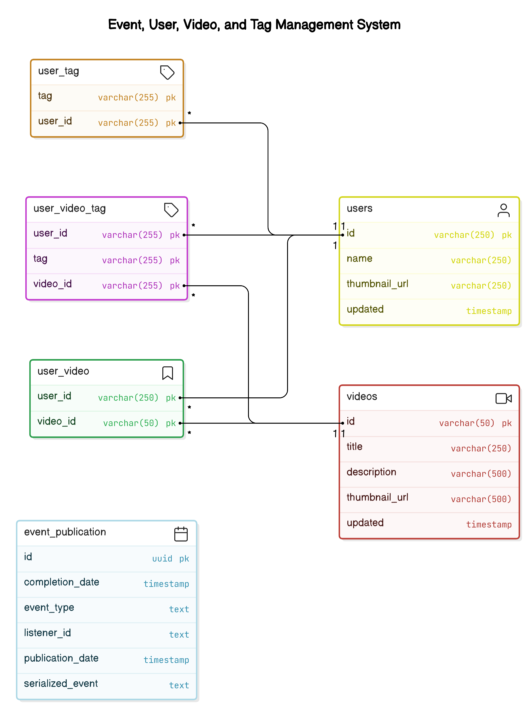

# YouTag

**Organize and Access Your Favorite YouTube Videos with Ease**

YouTag is a personal video library tool designed to help you save, userTag, and search YouTube videos effortlessly. By adding custom userTags to each video, you can create a personalized catalog that simplifies finding the videos you want when you need them.

## Key Features

1. **Easy Sign-In with Google**  
   Quick and secure login using your Google account, so you can start organizing your videos instantly.

2. **Save Videos with Links**  
   Just paste a YouTube link to save a video to your library, making it quick and hassle-free.

3. **Tag and Organize Videos**  
   Add custom userTags to each saved video, allowing you to categorize and label them according to your preferences. This makes searching for specific videos a breeze, even in a large collection.

## Benefits

- **Effortless Video Management**  
  Say goodbye to endless scrolling. YouTag's tagging system lets you sort and find your videos easily, tailored to your own organization style.

- **Personalized Organization**  
  Your userTags are unique to you, providing a flexible way to categorize videos for study, work, entertainment, and more.

- **Quick Access Anytime**  
  With YouTag, your favorite videos are just a search away, thanks to a fully customized tagging system.


### API Endpoints

#### Authentication Endpoints

##### Public Authentication
1. **Get Google Login URL**
    - **Endpoint**: `GET /api/public/auth/login/google`
    - **Description**: Generates and returns the Google OAuth authorization URL
    - **Response**:
      ```json
      {
        "data": "https://accounts.google.com/o/oauth2/v2/auth...",
        "message": "Success"
      }
      ```

2. **Google OAuth Redirect**
    - **Endpoint**: `GET /api/public/auth/redirect/google`
    - **Parameters**:
        - `code`: OAuth authorization code
        - `state`: OAuth state parameter
    - **Description**: Handles Google OAuth callback, validates the code, and generates JWT token
    - **Response**:
      ```json
      {
        "data": "jwt_token_string",
        "message": ""
      }
      ```

##### Authenticated User Endpoints
1. **Get User Information**
    - **Endpoint**: `GET /api/authenticated/auth/user`
    - **Description**: Retrieves the current authenticated user's information
    - **Authentication**: Required (JWT Token)
    - **Response**:
      ```json
      {
        "data": {
          "id": "user@example.com",
          "name": "John Doe",
          "thumbnailUrl": "https://example.com/avatar.jpg"
        },
        "message": ""
      }
      ```

#### Video Endpoints
1. **Save Video**
    - **Endpoint**: `POST /api/authenticated/video/{videoId}`
    - **Description**: Save a YouTube video to user's library
    - **Authentication**: Required (JWT Token)
    - **Possible Responses**:
        - Success: `200 OK` with video saved message
        - Already Saved: `409 Conflict` with existing video message
        - Error: Appropriate error response

2. **Delete Videos**
    - **Endpoint**: `DELETE /api/authenticated/video/`
    - **Query Parameters**:
        - `videos`: Comma-separated list of video IDs to delete
    - **Description**: Remove specific videos from user's library
    - **Authentication**: Required (JWT Token)
    - **Response**: Success message with deleted videos

3. **Get Saved Videos**
    - **Endpoint**: `GET /api/authenticated/video/`
    - **Query Parameters**:
        - `skip` (optional): Number of videos to skip (default: 0)
        - `limit` (optional): Number of videos to return (default: 10)
        - `videos` (optional): Comma-separated list of specific video IDs
    - **Description**: Retrieve saved videos with their tags
    - **Authentication**: Required (JWT Token)
    - **Response**: List of videos with their information and tags

#### Tag Endpoints
1. **Add Tags to Videos**
    - **Endpoint**: `POST /api/authenticated/tag/`
    - **Query Parameters**:
        - `tags`: Comma-separated list of tags
        - `videos`: Comma-separated list of video IDs
    - **Description**: Add tags to specific saved videos
    - **Authentication**: Required (JWT Token)
    - **Response**: Success message with added tags

2. **Remove Tags from Videos**
    - **Endpoint**: `DELETE /api/authenticated/tag/`
    - **Query Parameters**:
        - `tags` (optional): Comma-separated list of tags to remove
        - `videos` (optional): Comma-separated list of video IDs
    - **Description**: Remove tags from videos with multiple removal strategies
    - **Authentication**: Required (JWT Token)
    - **Response**: Success message with removed tags

3. **Get Tags and Tagged Videos**
    - **Endpoint**: `GET /api/authenticated/tag/`
    - **Query Parameters**:
        - `tags` (optional): Comma-separated list of tags
        - `videos` (optional): Comma-separated list of video IDs
        - `skip` (optional): Number of items to skip
        - `limit` (optional): Number of items to return
    - **Description**: Retrieve tags or videos based on different filtering strategies
    - **Authentication**: Required (JWT Token)
    - **Possible Responses**:
        - With no parameters: Returns all user tags
        - With tags: Returns videos with those tags
        - With videos: Returns tags for those videos

### Notes on Authentication
- All authenticated endpoints require a valid JWT token
- Token is obtained through the Google OAuth flow
- Token must be sent in the Authorization header
- Unauthenticated requests will receive a 401 Unauthorized response


## Technical Doc

### Table of Contents
- [Overview](#overview)
- [Architecture](#architecture)
- [Technology Stack](#technology-stack)
- [Domain Driven Design](#domain-driven-design)
- [Event Driven Architecture](#event-driven-architecture)
- [Database Design](#database-design)
- [Authentication & Authorization](#authentication--authorization)

### Overview
YouTags is a platform that allows users to organize their YouTube videos using custom userTags. Users can authenticate with their Google account, add YouTube videos to their collection, and manage them with personalized userTags for better organization and searchability.

### Architecture
The application follows a modular monolith architecture using Spring Modulith with clear boundaries between different domains:

```
├── auth          # Authentication and authorization
├── userTag           # Tag management
├── user          # User management
├── video         # Video information
├── user_video    # User-video relationships
├── webscraper    # YouTube data scraping
└── shared        # Shared components and orchestration
```

### Technology Stack

#### Backend
- **Framework**: Spring Boot
- **Core Technologies**:
    - Spring Web: REST API implementation
    - Spring Modulith: Modular application architecture
    - Spring Data JPA: Database operations
    - Spring Security: Authentication and authorization
- **Build Tool**: Gradle
- **Database**: PostgreSQL

#### Frontend
- **Framework**: Flutter

### Domain Driven Design
The project follows Domain-Driven Design principles, structured into modules using Spring Modulith to ensure a clean modular monolith architecture.

#### Module Structure
Each business domain is organized into its own module with the following package structure:

```
module/
├── api/              # Public interfaces and DTOs
├── application/      # Business logic implementation
├── domain/          # Domain models and entities
└── infrastructure/  # Technical implementations (repos, configs)
```

#### Key DDD Principles Implementation
1. **Bounded Contexts**: Each module represents a bounded context with clear boundaries
2. **Module Independence**: No circular dependencies between modules
3. **Pure Services**: Services don't directly depend on other module's services
4. **Orchestration**: The `shared` module's EndpointController orchestrates cross-module operations

#### Service Orchestration
To maintain module independence while allowing complex operations that span multiple domains, we use the Orchestrator pattern:

```java
public class OrchestratorService {
    /**
     * Delete the entry from user_video table
     * Delete tags from user_video_tag tables
     * <p>
     * Remove redundant tags and Remove redundant video if they are not used anymore
     */
    public void deleteSpecificSavedVideosOfUser(String userId, Set<String> videoIds) {
        log.debug("Deleting Saved videos {} of user {}", videoIds, userId);
    }
}
```

### Event Driven Architecture
The system uses events to maintain loose coupling between modules while ensuring reliable event processing.

#### Event Processing
- Uses Spring Modulith's event publication system
- Events are persisted in the database to ensure delivery
- System checks for incomplete events on startup
- Automatic retry mechanism for failed event processing

#### Event Storage
Events are stored in the `event_publication` table:
```sql
create table event_publication (
    id               uuid not null primary key,
    completion_date  timestamp(6) with time zone,
    event_type       text,
    listener_id      text,
    publication_date timestamp(6) with time zone,
    serialized_event text
);
```

### Database Design


#### Index Optimization
The database schema includes carefully designed indexes for optimal query performance:

##### Video-related Queries
1. **User-Video Relationship Queries**:
   ```sql
   create index if not exists idx_user_video_user_video on user_video(user_id, video_id);
   create index if not exists idx_user_video_user on user_video(user_id);
   create index if not exists idx_user_video_video on user_video(video_id);
   ```
   - `idx_user_video_user_video`: Optimizes queries for specific user's specific video
   - `idx_user_video_user`: Helps in retrieving all videos for a user
   - `idx_user_video_video`: Assists in finding which users have a particular video

##### Tag-related Queries
1. **User Tag Queries**:
   ```sql
   create index if not exists idx_user_tag_user on user_tag(user_id);
   create index if not exists idx_user_tag_user_tag on user_tag(user_id, tag);
   create index if not exists idx_user_tag_tag on user_tag(tag);
   ```
   - `idx_user_tag_user`: Retrieves all tags for a specific user
   - `idx_user_tag_user_tag`: Checks existence of a specific tag for a user
   - `idx_user_tag_tag`: Finds users associated with a particular tag

##### User-Video-Tag Queries
1. **Tag and Video Relationship Queries**:
   ```sql
   create index if not exists idx_user_video_tag_user_video on user_video_tag(user_id, video_id);
   create index if not exists idx_user_video_tag_user_video_tag on user_video_tag(user_id, video_id, tag);
   create index if not exists idx_user_video_tag_user_tag on user_video_tag(user_id, tag);
   ```
   - `idx_user_video_tag_user_video`: Retrieves tags for a specific user's video
   - `idx_user_video_tag_user_video_tag`: Checks existence of a specific tag on a user's video
   - `idx_user_video_tag_user_tag`: Finds videos for a user with a specific tag

##### Index Coverage for Common Queries
1. Find videos by user_id: Uses `idx_user_video_user`
2. Find tags by user_id: Uses `idx_user_tag_user`
3. Find videos by user_id + tag: Uses `idx_user_video_tag_user_tag`
4. Find tags for a specific user's video: Uses `idx_user_video_tag_user_video`
5. Verify a specific tag on a user's video: Uses `idx_user_video_tag_user_video_tag`

**Notes**:
- Indexes are created with `if not exists` to prevent errors during repeated deployments
- The indexes provide efficient lookup paths for most common database operations
- These indexes balance read performance with minimal write overhead

### Authentication & Authorization

#### Security Implementation
- Spring Security for authentication and authorization framework
- Google OAuth2 for user authentication
- JWT tokens for session management

#### Security Configuration
```java
@Configuration
public class SecurityConfig {
    // CSRF disabled for API endpoints
    // CORS configured with * for development
    // JWT token validation filter
    // Public endpoints whitelisting
}
```

#### Authentication Flow
1. User initiates Google OAuth login
2. Server validates OAuth response
3. JWT token generated for authenticated user
4. Subsequent requests use JWT token for authentication

#### Security Measures
- JWT token validation per request
- Protected endpoints require authentication
- CORS configuration (configurable for production)
- No session management (stateless API)

#### Development vs Production
- Development: CORS allowed from all origins
- Production: Strict CORS policy with specific origins, headers, and methods

