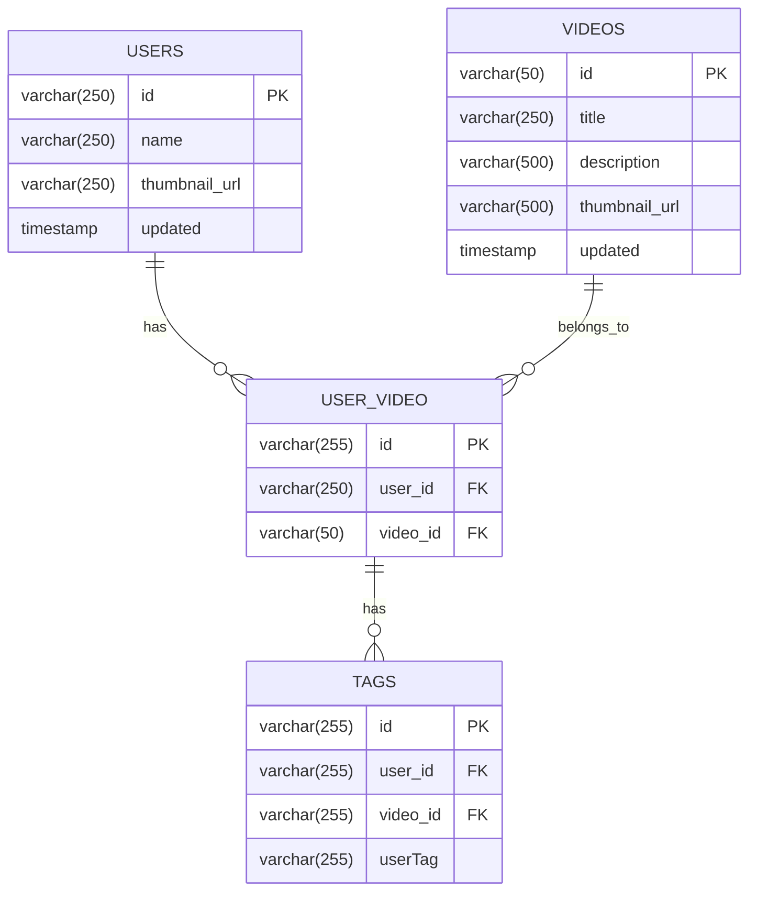

# YouTag

**Organize and Access Your Favorite YouTube Videos with Ease**

YouTag is a personal video library tool designed to help you save, userTag, and search YouTube videos effortlessly. By adding custom userTags to each video, you can create a personalized catalog that simplifies finding the videos you want when you need them.

## Key Features

1. **Easy Sign-In with Google**  
   Quick and secure login using your Google account, so you can start organizing your videos instantly.

2. **Save Videos with Links**  
   Just paste a YouTube link to save a video to your library, making it quick and hassle-free.

3. **Tag and Organize Videos**  
   Add custom userTags to each saved video, allowing you to categorize and label them according to your preferences. This makes searching for specific videos a breeze, even in a large collection.

## Benefits

- **Effortless Video Management**  
  Say goodbye to endless scrolling. YouTag’s tagging system lets you sort and find your videos easily, tailored to your own organization style.

- **Personalized Organization**  
  Your userTags are unique to you, providing a flexible way to categorize videos for study, work, entertainment, and more.

- **Quick Access Anytime**  
  With YouTag, your favorite videos are just a search away, thanks to a fully customized tagging system.

## Technical Doc

### Table of Contents
- [Overview](#overview)
- [Architecture](#architecture)
- [Technology Stack](#technology-stack)
- [Domain Driven Design](#domain-driven-design)
- [Event Driven Architecture](#event-driven-architecture)
- [Database Design](#database-design)
- [Authentication & Authorization](#authentication--authorization)
- [Getting Started](#getting-started)

### Overview
YouTags is a platform that allows users to organize their YouTube videos using custom userTags. Users can authenticate with their Google account, add YouTube videos to their collection, and manage them with personalized userTags for better organization and searchability.

### Architecture
The application follows a modular monolith architecture using Spring Modulith with clear boundaries between different domains:

```
├── auth          # Authentication and authorization
├── userTag           # Tag management
├── user          # User management
├── video         # Video information
├── user_video    # User-video relationships
├── webscraper    # YouTube data scraping
└── shared        # Shared components and orchestration
```

### Technology Stack

#### Backend
- **Framework**: Spring Boot
- **Core Technologies**:
    - Spring Web: REST API implementation
    - Spring Modulith: Modular application architecture
    - Spring Data JPA: Database operations
    - Spring Security: Authentication and authorization
- **Build Tool**: Gradle
- **Database**: PostgreSQL

#### Frontend
- **Framework**: Flutter

### Domain Driven Design
The project follows Domain-Driven Design principles, structured into modules using Spring Modulith to ensure a clean modular monolith architecture.

#### Module Structure
Each business domain is organized into its own module with the following package structure:

```
module/
├── api/              # Public interfaces and DTOs
├── application/      # Business logic implementation
├── domain/          # Domain models and entities
└── infrastructure/  # Technical implementations (repos, configs)
```

#### Key DDD Principles Implementation
1. **Bounded Contexts**: Each module represents a bounded context with clear boundaries
2. **Module Independence**: No circular dependencies between modules
3. **Pure Services**: Services don't directly depend on other module's services
4. **Orchestration**: The `shared` module's EndpointController orchestrates cross-module operations

#### Service Orchestration
To maintain module independence while allowing complex operations that span multiple domains, we use the Orchestrator pattern:

```java
@RestController
class EndpointController {
    private final UserService userService;
    private final VideoService videoService;
    private final TagService tagService;
    
    // Orchestrates operations across multiple services
    // without services directly depending on each other
}
```

### Event Driven Architecture
The system uses events to maintain loose coupling between modules while ensuring reliable event processing.

#### Event Processing
- Uses Spring Modulith's event publication system
- Events are persisted in the database to ensure delivery
- System checks for incomplete events on startup
- Automatic retry mechanism for failed event processing

#### Event Storage
Events are stored in the `event_publication` table:
```sql
create table event_publication (
    id               uuid not null primary key,
    completion_date  timestamp(6) with time zone,
    event_type       text,
    listener_id      text,
    publication_date timestamp(6) with time zone,
    serialized_event text
);
```

### Database Design

#### Entity Relationship Diagram


#### Index Optimization
The database schema includes carefully designed indexes for optimal query performance:

1. **Video Search**:
   ```sql
   create index idx_videos_title on videos(title);
   ```

2. **User-Video Relationships**:
   ```sql
   create index idx_user_videos_video on user_video (video_id);
   create index idx_user_videos_composite on user_video (user_id, video_id);
   ```

3. **Tag Operations**:
   ```sql
   create index idx_tags_user_video_tag on userTags (user_id, video_id, userTag);
   create index idx_tags_user_tag ON userTags (user_id, userTag);
   ```

#### Index Coverage for Common Queries
1. Find by user_id: Uses prefix of idx_tags_user_video_tag or idx_tags_user_tag
2. Find by user_id + video_id: Uses prefix of idx_tags_user_video_tag
3. Find by user_id + userTag: Uses idx_tags_user_tag
4. Find by user_id + video_id + userTag: Uses full idx_tags_user_video_tag
5. Find videos by video_id: Uses idx_user_videos_video

### Authentication & Authorization

#### Security Implementation
- Spring Security for authentication and authorization framework
- Google OAuth2 for user authentication
- JWT tokens for session management

#### Security Configuration
```java
@Configuration
public class SecurityConfig {
    // CSRF disabled for API endpoints
    // CORS configured with * for development
    // JWT token validation filter
    // Public endpoints whitelisting
}
```

#### Authentication Flow
1. User initiates Google OAuth login
2. Server validates OAuth response
3. JWT token generated for authenticated user
4. Subsequent requests use JWT token for authentication

#### Security Measures
- JWT token validation per request
- Protected endpoints require authentication
- CORS configuration (configurable for production)
- No session management (stateless API)

#### Development vs Production
- Development: CORS allowed from all origins
- Production: Strict CORS policy with specific origins, headers, and methods
  [Previous sections remain the same...]

## API Endpoints
### WIP